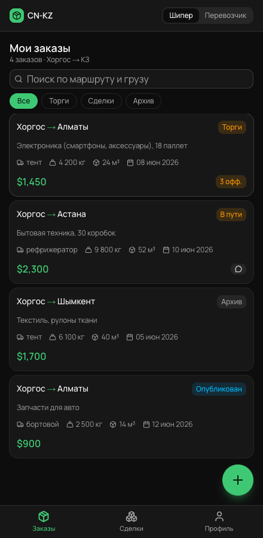
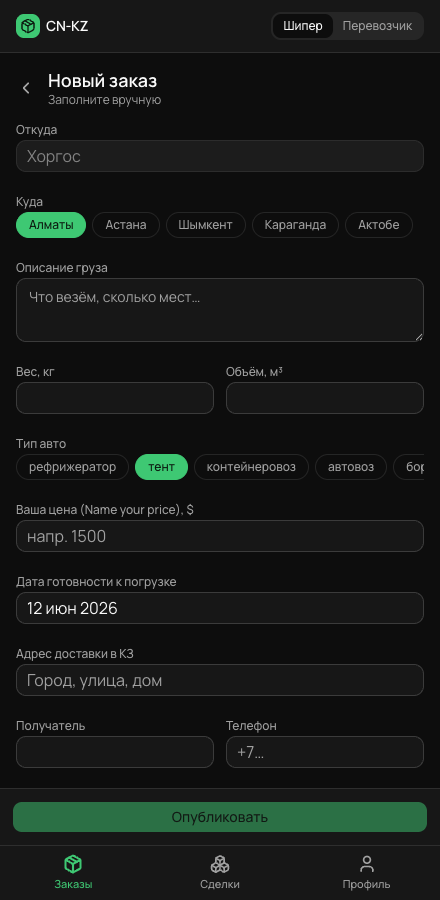
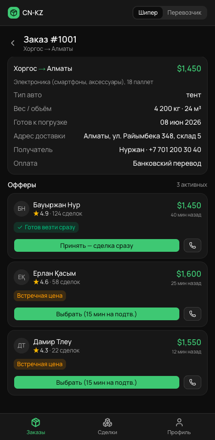
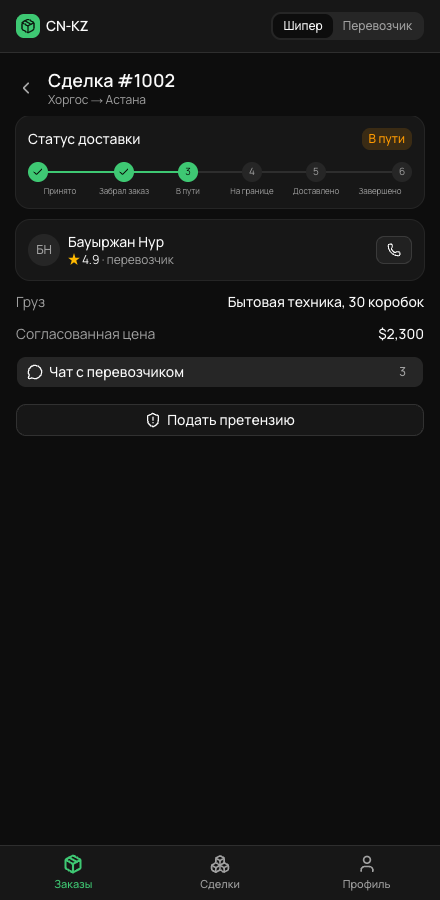
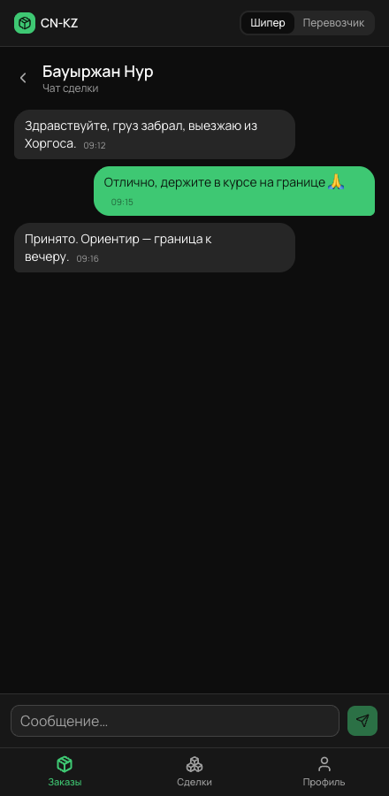
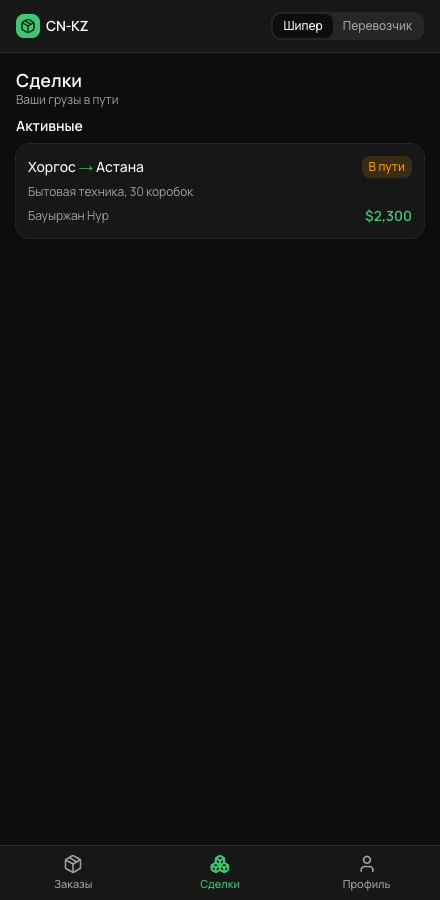
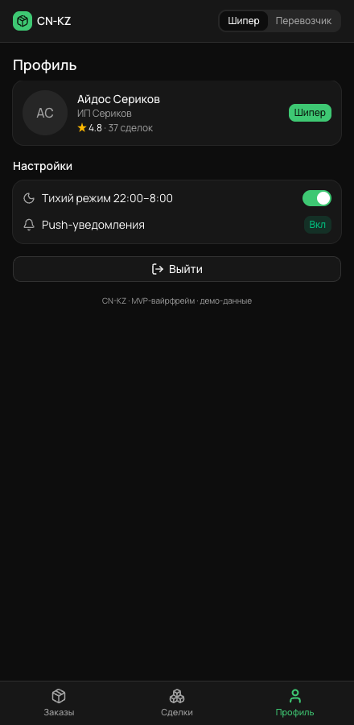
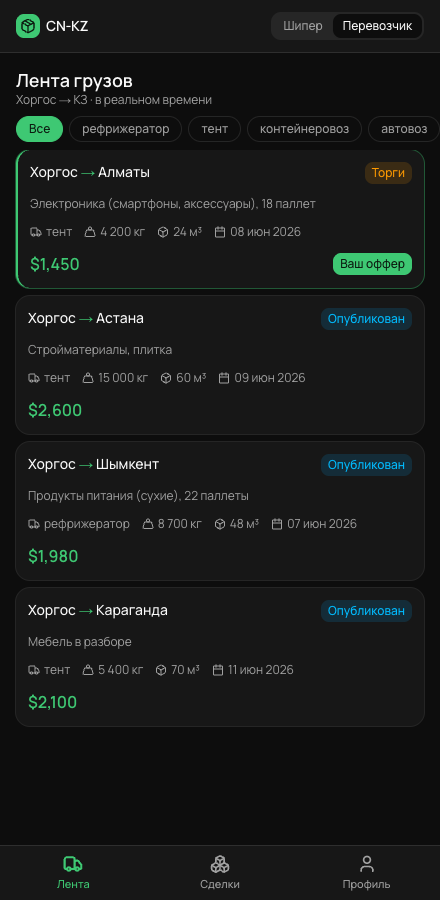
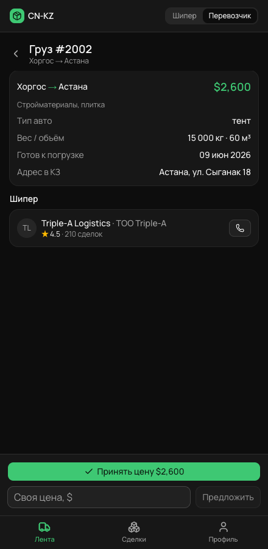
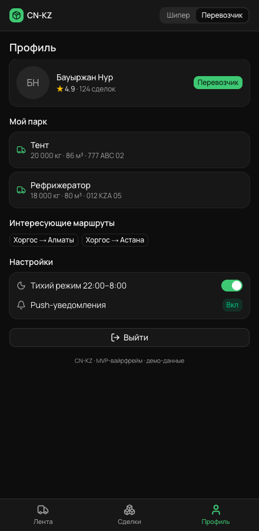

# CN-KZ — MVP Wireframe Screens

Styled mockup of the CN-KZ freight marketplace (Хоргос → KZ). Captured from the live app (`bun run dev` → http://localhost:3000), phone viewport ~390px. Two roles via the header toggle.

**Design language:** dark theme · **Bolt-green** accent (`oklch(0.74 0.17 152)`) · **Manrope** font — inspired by mobility/driver apps (inDrive, Bolt, Grab, Uber). Earlier explorations in `options/` (opt1 = light/Manrope/green Uber-Bolt style, opt2 = dark/Inter/lime inDrive style).

## Шипер (shipper)
| Screen | File |
|---|---|
| Мои заказы (home feed + filter chips + FAB) |  `wf-01-shipper-orders.png` |
| Новый заказ (publish form) |  `wf-02-create-order.png` |
| Заказ + офферы (accept / counter) |  `wf-03-shipper-order-offers.png` |
| Сделка (status stepper) |  `wf-04-shipper-deal.png` |
| Чат сделки |  `wf-05-chat.png` |
| Сделки (dashboard) |  `wf-06-shipper-deals.png` |
| Профиль |  `wf-07-shipper-profile.png` |

## Перевозчик (carrier)
| Screen | File |
|---|---|
| Лента грузов (feed + truck-type filter, "Ваш оффер") |  `wf-08-carrier-feed.png` |
| Груз + торги (Принять цену / Своя цена) |  `wf-09-carrier-cargo-offer.png` |
| Профиль + парк фур + маршруты |  `wf-10-carrier-profile.png` |

> Snapshots are static. The interactive wireframe is the running app — see `components/cn-kz/` and `docs/PRD.md`.
